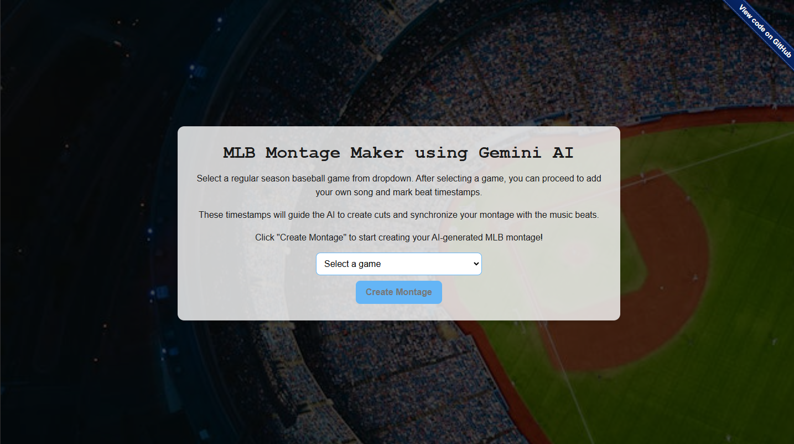
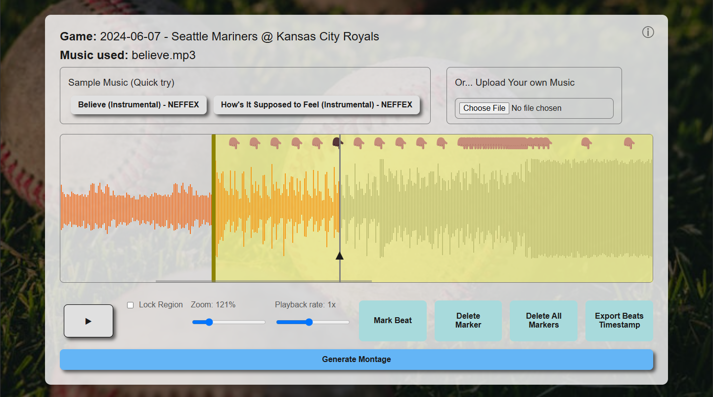
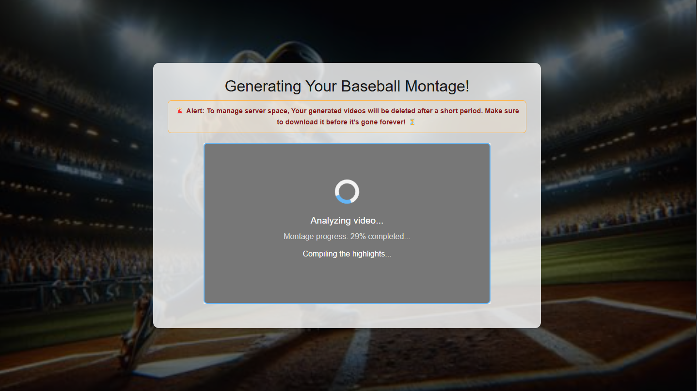
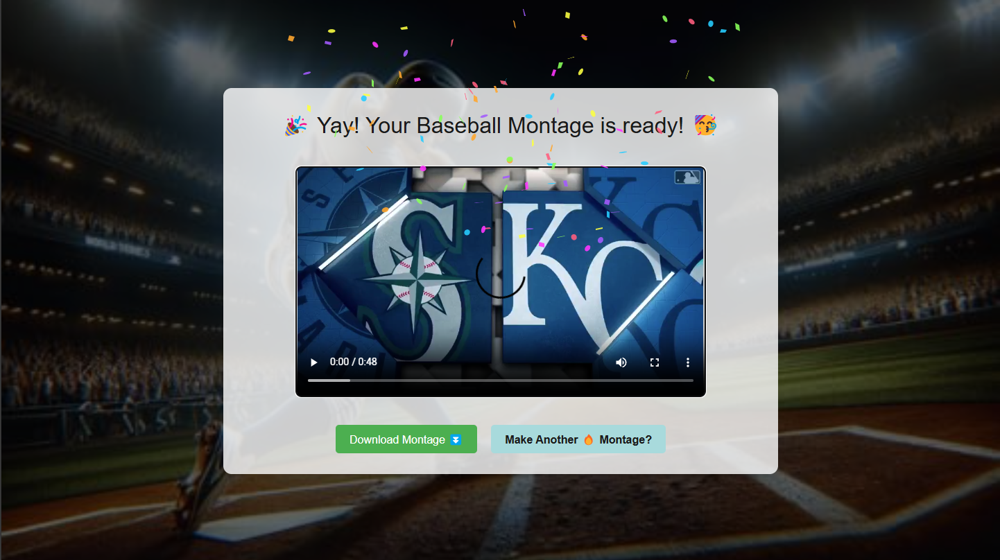

# MLB Montage Maker: Turn Baseballs into Beat-Balls! ⚾🎶

Create dynamic MLB montages synced to music using AI! Because let's be honest, sometimes baseball games need a little... _oomph_.
MLB Montage Maker is not just another web app; it's a _revolution_ in baseball viewing! (Okay, maybe a slight exaggeration, but it's still pretty cool).
It allows you to create personalized baseball montages. Select a regular season MLB game, upload your favorite music (anything from Bach to Bieber, we don't judge), mark the beat timestamps, and let the power of AI generate a highlight reel.

## Witness the Magic in 4 (Easy?) Steps! ✨

**STEP 1: Game On!** 
Select a game from the dropdown.

    

 

**STEP 2: Drop the Beat (and Your Song)** 
Upload your song and visually mark the beats.

    

 

**STEP 3: ????** 
This is where the AI Sorcery happens. Our Google Gemini-powered backend works its magic. Montage creation in progress!

    

 

**STEP 4: PROFIT!!!** 
Behold! Your baseball montage, perfectly synced to your chosen beats. Download it, share it, become a legend! 😆

    

## Usage:

From Zero to Montage Hero in Minutes! (\*Results May Vary).

1.  **Open the MLB Montage Maker in your browser.** (Usually `http://localhost:5173` during local development).
2.  **Select a game** from the dropdown menu. The video player will load the selected game.
3.  Click the **"Create Montage"** button. This will redirect you to the Beat Editor page. Prepare for beat-marking action!
4.  **Choose your music:**
    - Click on one of the **sample music tracks** for a quick try.
    - **OR** Click on the **"Choose File"** button under "Or... Upload Your own Music" to upload your own audio file.
5.  **Mark Beat Timestamps:** Get rhythmic!
    - Use the **Play/Pause** button to listen to your music. Earbuds recommended, unless you want to annoy your coworkers/family.
    - Click the **"Mark Beat"** button at the moments you want to mark a beat. Markers will appear on the waveform.
    - **Adjust Markers:** You can drag markers to fine-tune their positions.
    - **Delete Markers:** Select a marker (it will change color), and then click **"Delete Marker"**. **"Delete All Markers"** will remove all beat markers.
6.  **Adjust the Reel Region:** The yellow region on the waveform represents the section of the music that will be used for the montage. You can drag and resize this region to select your desired portion of the song (must be between 25-60 seconds). Keep it concise, keep it impactful.
7.  **Optional: Lock Reel Region:** Check the "Lock Region" checkbox to prevent accidental dragging or resizing of the reel region. For when you're _really_ happy with your reel region placement.
8.  **Click "Generate Montage"**. The moment of truth!
9.  You will be redirected to the Montage Viewer page. Here, you can track the progress of your montage generation.
10. Once the montage is complete, the video will appear, and you can **watch it online** and click the **"Download Montage"** button to download the MP4 video file.
11. To create another montage, click **"Make Another 🔥 Montage?"** to return to the game selection page. Because one montage is never enough.

## Technologies Used

**Frontend:**

- **HTML, CSS, JavaScript:** For the user interface and application logic.
- **Vite:** For fast frontend development and build process.
- **hls.js:** For playing HLS (HTTP Live Streaming) video content.
- **wavesurfer.js:** For displaying and interacting with audio waveforms, enabling beat marking.
- **canvas-confetti:** For celebratory confetti animation upon successful montage generation. Because who doesn't love digital confetti? 🎉

**Backend:**

- **Node.js:** JavaScript runtime environment for the server-side application.
- **Express.js:** Web application framework for building the backend API.
- **multer:** Middleware for handling file uploads (audio files).
- **cors:** Middleware to enable Cross-Origin Resource Sharing for frontend-backend communication.
- **fluent-ffmpeg:** Node.js interface to FFmpeg for powerful video processing.
- **@ffmpeg-installer/ffmpeg:** Automatically installs FFmpeg for use in the backend.
- **@google-cloud/vertexai:** Google Cloud Vertex AI SDK for talking to the AI overlords... I mean, _models_.

## Configuration:

To run this project locally, follow these steps.

1.  **Backend Configuration:**

    - In the `backend` directory, create a `.env` file.
    - Copy the contents of `.env.sample` into `.env` and fill in the necessary environment variables. This likely includes:
      - **Google Cloud Project ID:** Your Google Cloud Project ID.
      - **Vertex AI API Key/Credentials:** You'll need to set up authentication for accessing the Vertex AI API. _(Refer to Google Cloud Vertex AI documentation for the best way to handle credentials, especially for deployment.)_
    - Ensure your Google Cloud project has the Vertex AI API enabled.

2.  **Frontend Configuration:**
    - Open `frontend/src/main.js`.
    - Check the `BACKEND_ENDPOINT` variable.
      - For **local development**, it might be set to `'http://localhost:3000'`.
      - If you are running the backend on a different port or want to point to your deployed backend, update this value accordingly.

## License:

This project is licensed under the **MIT License**. See the [LICENSE](LICENSE) file for the legal stuff.

## Author:

### The Montage Maestro (aka, mehraDotDev) 😝
